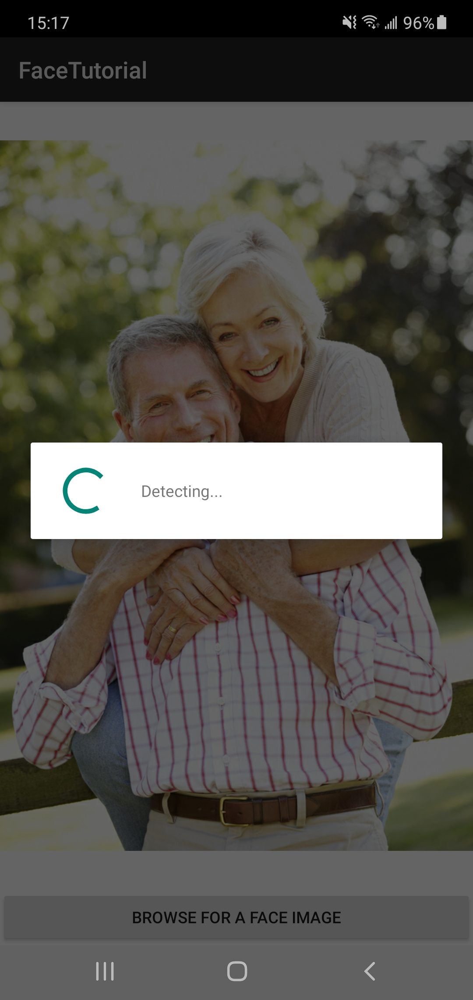
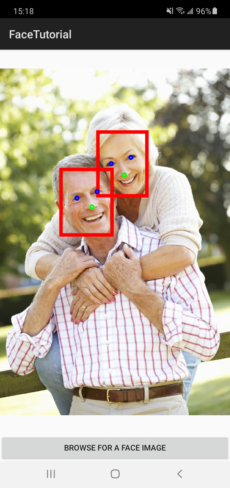

## Android Detect

The sample demonstrates how to use Azure Face API to detect and frame faces in an image on Android:

|  |  |
| :-: | :-: |


### Key Features

* Learn how to call face detection API via Java SDK and retrieve facial information.
* Draw bounding boxes and landmarks on Bitmap in an ImageView.


### Prerequisites

* [Android Studio](https://developer.android.com/studio) (API Level 28+)
* Java SDK `com.azure:azure-ai-vision-face:1.0.0-beta.2` for Gradle


### Setup and Build

[Create a Face resource](https://portal.azure.com/#create/Microsoft.CognitiveServicesFace) in the Azure portal and obtain a key and endpoint URL to call face detection API.

Edit the source file `app/src/main/java/com/contoso/facetutorial/MainActivity.java` and replace the two lines with your own subscription:

```diff
-   private final String apiEndpoint = System.getenv("FACE_ENDPOINT");
+   private final String apiEndpoint = "your_face_endpoint";
-   private final String subscriptionKey = System.getenv("FACE_SUBSCRIPTION_KEY");
+   private final String subscriptionKey = "your_face_key";
```
