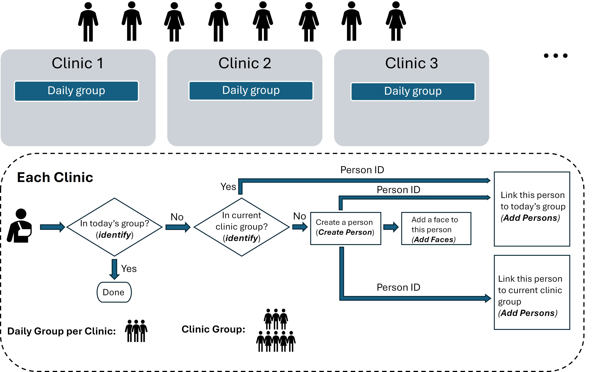

## Clinic Person Management

The script is designed to automate the management of patient face detection, identification, and enrollment in a clinic system that uses Azure's Dynamic Person Groups. The goal is to ensure that each patient's face is efficiently recognized and linked to both daily and clinic-specific dynamic person groups, improving the accuracy of face identification and reducing redundancies across multiple clinics. The system operates with **No Training Required**, allowing faster setup and updates, and eliminates the need for buffer groups, simplifying group management with **No Buffer Groups**.

### Example Flow
 

### Key Features

* **Dynamic Group Management**: Automatically create and manage clinic-specific and daily dynamic person groups.
* **Person References**: Persons are created once and added to dynamic groups by reference, avoiding duplicate data.
* **Clinic Groups**: Each clinic has its own permanent dynamic person group for patient management.
* **Daily Groups**: Temporary daily visit lists are created as smaller dynamic groups within the clinic group.
* **No Training or Buffer Groups**: Simplifies setup with no training step and no need for buffer groups.
* **Scalable for Clinics**: Supports multiple clinics with unique dynamic and daily person groups.

### Steps Involved

* Face Detection:
    * Detect the largest face in the input image using the Azure Face API.
    * If no face is detected, log the result and terminate the process.
* Check/Generate Groups:
    * Verify if the clinic-specific dynamic person group exists; if not, create it.
    * Verify if the daily dynamic person group (specific to the clinic and date) exists; if not, create it.
    * Ensure groups are created without buffer groups, simplifying the process.
* Face Identification:
    * Attempt to identify the face in the daily dynamic group first.
    * If no match is found in the daily group, check the clinic-specific group for a match.
* Person Creation:
    * If the face is not identified in either group, create a new person.
    * Add the detected face to the newly created person’s profile.
* Person Reference Linking:
    * Link the newly created or identified person by reference to the daily dynamic group for the current visit.
    * Also, link the person by reference to the clinic-specific dynamic person group for long-term management.
* No Training Step:
    * The system requires no training step, allowing immediate updates and faster setup.
    * Faces can be enrolled and recognized in the dynamic groups without additional training processes.
* Completion:
    * Log the outcome, including whether the person was identified or newly created.
    * Ensure the person is linked correctly to both the clinic and daily dynamic person groups.