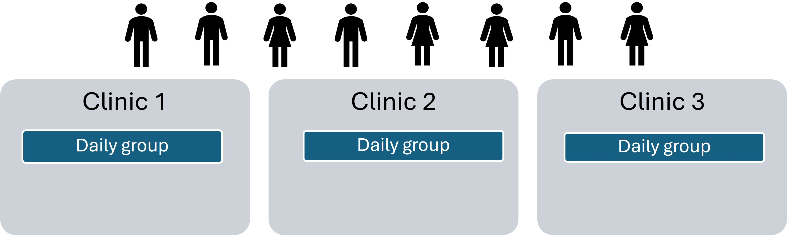
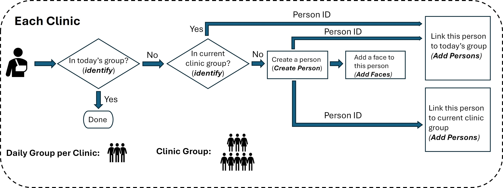

## Customer Checkin Management

This sample code is designed to manage customer check-ins using facial recognition technology. It handles face enrollment and identification by utilizing PersonDirectory, adding customers into both daily and location-specific dynamic person groups. This ensures accurate and efficient recognition during the check-in process.

### Example Scenario (Clinic)
- Person are created and added into DynamicPersonGroup by reference.
- Clinic: Each clinic will have its own group.
- Daily Group: A smaller, temporary group for the daily visit list, nested within the larger - clinic group.

### Workflow

### Key Features

* **No Training Required**: Faster setup and updates without a training step.
* **Dynamic Group Management**: Automatically create and manage clinic-specific and daily dynamic person groups.
* **Person References**: Persons are created once and added to dynamic groups by reference, avoiding duplicate data.

### Steps Involved

* Face Detection:
    * Detect the largest face in the input image using the Azure Face API.
    * If no face is detected, log the result and terminate the process.
* Check/Generate Groups:
    * Verify if the clinic-specific/daily dynamic person group exists; if not, create it.
    * Ensure groups are created without buffer groups, simplifying the process.
* Face Identification:
    * Attempt to identify the face in the daily dynamic group first.
    * If no match is found in the daily group, check the clinic-specific group for a match.
* Person Creation:
    * If the face is not identified in either group, create a new person.
    * Add the largest detected face to the newly created person’s profile.
* Person Reference Linking:
    * Link the newly created or identified person by reference to the daily dynamic group for the current visit.
    * Link the person by reference to the clinic-specific dynamic person group for long-term management.