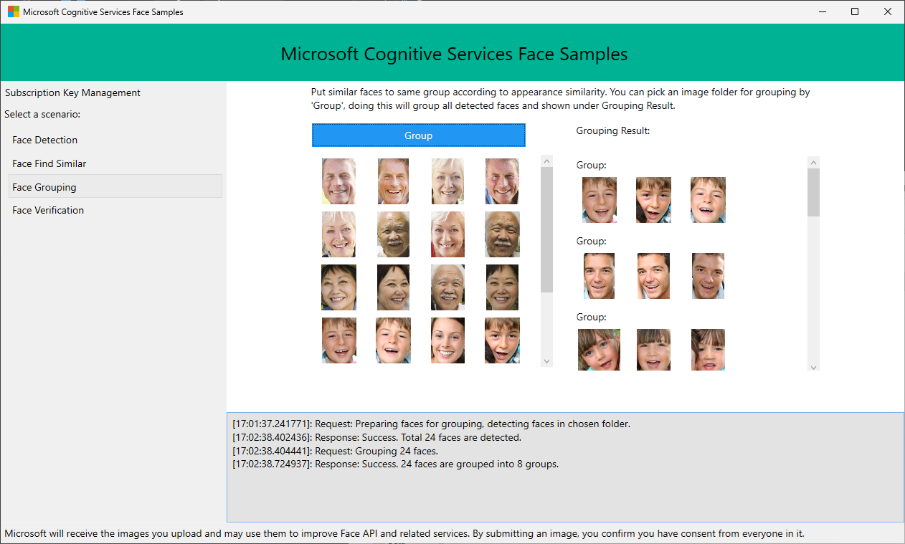

## Demo for Windows Presentation Foundation (WPF)

This sample is a WPF application to demonstrate the use of Azure Face API. It demonstrates face detection, face grouping, finding similar faces, and face verification.

### Prerequisites

* Microsoft Visual Studio 2022
* Windows .NET Framework 4.8
* Face SDK: `dotnet add package Azure.AI.Vision.Face --prerelease`

### Build and Run

1. Open Microsoft Visual Studio and select `File > Open > Project/Solution > FaceAPI-WPF-Samples.sln` to load the projects.
2. Press Ctrl+Shift+B, or select `Build > Build Solution` to build the solution. Visual Studio may prompt you to install the Face SDK NuGet package. Install the latest version using the NuGet package manager.
3. Press F5, or select the green "Start" arrow to run the sample. Images under the Data/ folder can be used to try the application.

### Key and Endpoint

[Create a Face resource](https://portal.azure.com/#create/Microsoft.CognitiveServicesFace) in the Azure portal and obtain a key and endpoint URL for face API operations.

Navigate to the "Subscription Key Management" tab on the top right corner when app starts. Edit the text boxes to update the values. You can choose to persist your subscription key in your machine by clicking "Save Key" button. When you want to delete the subscription key from the machine, click "Delete Key" to remove it from your machine.
