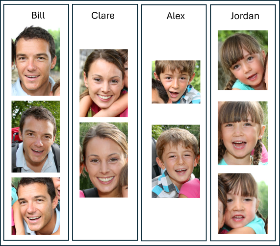
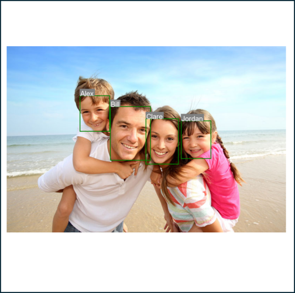

## Face Photo Tagging

This repository contains scripts demonstrating how to enroll faces for each person from directories of images and tag faces for new input images using the Dynamic Person Group.

| Enrollment | Tagging |
| :-: | :-: |
|  |  |

### Key Features

* Learn how to enroll persons with faces from images.
* Create and manage dynamic person groups.
* Tag faces by matching them against a dynamic person group or a list of persons.

### Steps Involved

* Enroll Single Face Per Person
    * Detect faces in images from a directory.
    * Filter out low quality faces.
    * Enroll a single medium/high quality face per person from each image.
    * Create a dynamic person group.
* Enroll Multiple Faces Per Person
    * Detect faces in images from subfolders representing different persons.
    * Filter out low quality faces.
    * Enroll multiple medium/high quality faces per person from each subfolder.
    * Create a dynamic person group.
* Tag Faces for Input Images
    * Detect faces in a new input image.
    * Match the detected face against the enrolled faces in the dynamic person group.
    * Tag the face corresponding to the best match.