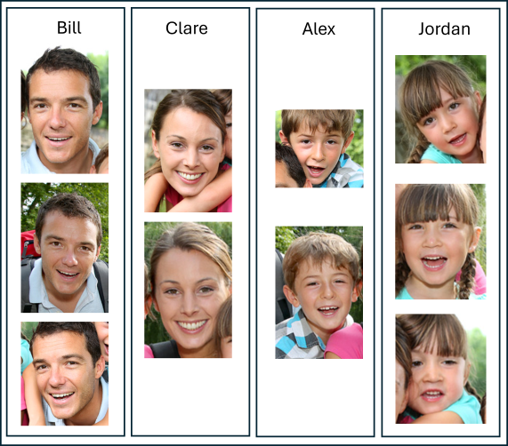

## Person Profile Registration

This repository contains scripts demonstrating how to enroll faces for each person from directories of images and recognize new persons from images using the Dynamic Person Group.

| Enrollment | Recognition |
| :-: | :-: |
|  |  |

### Key Features

* Learn how to enroll persons with faces from images.
* Create and manage dynamic person groups.
* Recognize faces against a dynamic person group or a list of persons.

### Steps Involved

* Enroll Single Face Per Person
    * Detect faces in images from a directory.
    * Filter out low quality faces.
    * Enroll a single medium/high quality face per person from each image.
    * Create a dynamic person group.
* Enroll Multiple Faces Per Person
    * Detect faces in images from subfolders representing different persons.
    * Filter out low quality faces.
    * Enroll multiple medium/high quality faces per person from each subfolder.
    * Create a dynamic person group.
* Recognize Faces
    * Recognize the enrolled persons using a test image.