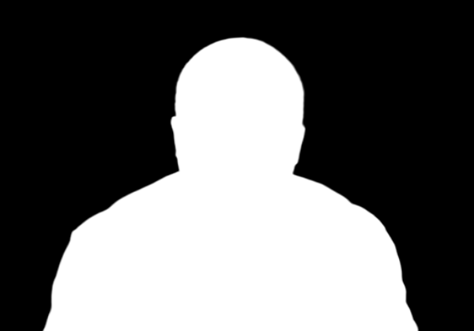
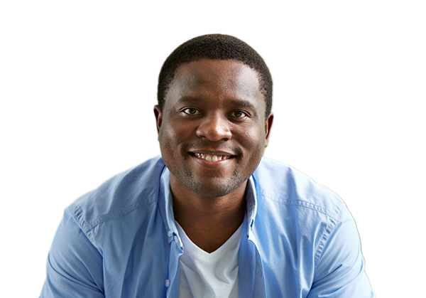

## Portrait Processing

The sample demonstrates how to make a portrait image out of an original image by using Azure Face API and Azure Background Removal API, as illustrated below:

| Input | Matting | Portrait |
| :-: | :-: | :-: |
|  |  |  |

### Key Features

* Learn how to call face detection API via SDK and retrieve facial attirbutes such us bounding box, head pose, blur level, quality, etc.
* Use background removal service to get the foreground matting.
* Optimize network lantency by down-scaling and compressing input image as JPEG stream.
* Leverage "foregroundMatting" mode instead of "backgroundRemoval" when removing backround, and apply alpha channel locally. In this way we can minimize the data transmitted.

### Steps Involved

1. Download an image from web URL.
2. Resize image and compress as JPEG memory stream.
3. Detect faces in the image.
4. Read the returned facial attributes.
5. Optionally, check whether the face quality is suitable for portrait processing.
6. Crop the face out from the image.
7. Request for foreground matting of the face crop.
8. Merge the matting as the alpha channel of the face crop.
9. All done. Portrait generated.
